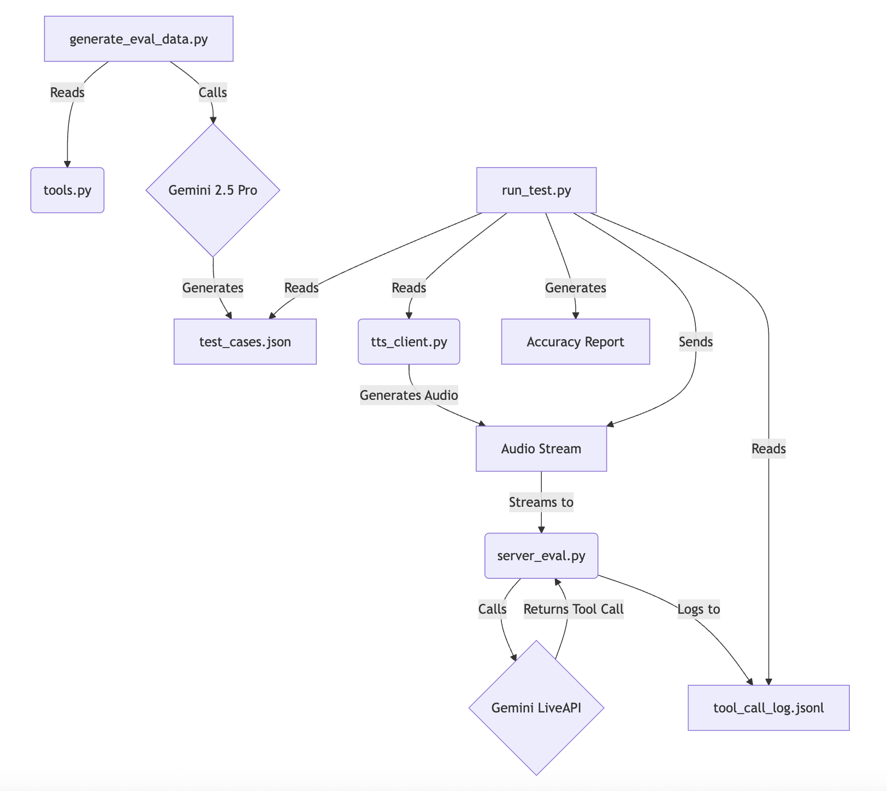

# LiveAPI Automated Testing Framework

## 1. Project Overview

This project provides a robust, automated testing framework for a voice-controlled LiveAPI powered by Google's Gemini models. It is designed to evaluate the accuracy of the API's tool-calling capabilities by simulating real-time audio streams and analyzing the server's responses.

The framework includes a specialized evaluation server for running automated tests, with features for audio recording, detailed logging, and single-turn session management.

A key feature of this framework is the ability to dynamically generate test cases using Gemini 1.5 Pro, ensuring a diverse and comprehensive set of evaluation data.

## 2. Architecture

The project is composed of several key files, each with a specific role:

*   **`tools.py`**: The "source of truth" for the API's capabilities. It defines the available tools, their descriptions, and their parameters.
*   **`config.py`**: The central configuration file for all settings, including GCP project details, TTS parameters, and file paths.
*   **`tts_client.py`**: A dedicated client for interacting with the Google Cloud Text-to-Speech API to generate audio from text.
*   **`common.py`**: Contains the base WebSocket server class and other common components.
*   **`server_eval.py`**: The evaluation server, which includes features for audio recording, detailed logging, and single-turn session management.
*   **`run_test.py`**: The main orchestration script for the testing workflow. It loads test cases, sends them to the evaluation server, and analyzes the results.
*   **`test_cases.json`**: A JSON file containing the test cases to be used by the evaluation script.
*   **`generate_eval_data.py`**: A powerful tool that uses Gemini 1.5 Pro to dynamically generate test cases based on the tool definitions in `tools.py`.

## 3. Flow Diagram

This diagram illustrates the workflow of the automated testing framework:



## 4. Running the Evaluation

Follow these steps to run the automated test suite:

### Step 1: Set Up the Environment

1.  **Install Dependencies**:
    ```bash
    pip install -r pythonsdk-eval-live/server/requirements.txt
    pip install pydantic
    ```

2.  **Authenticate with Google Cloud**:
    ```bash
    gcloud auth application-default login
    ```

### Step 2: Generate Evaluation Data

1.  **Run the generation script**:
    ```bash
    python pythonsdk-eval-live/server/generate_eval_data.py
    ```
    This will use Gemini 2.5 Pro to create a fresh set of test cases and save them to `test_cases.json`.

### Step 3: Run the Automated Test

1.  **Start the Evaluation Server**:
    ```bash
    python pythonsdk-eval-live/server/server_eval.py
    ```

2.  **In a separate terminal, execute the test script**:
    ```bash
    python pythonsdk-eval-live/server/run_test.py
    ```

The script will then execute the test cases, and you will see a final accuracy report in the console. All recorded audio and logs will be saved in the `pythonsdk-eval-live/server/results/` directory.

## 5. Sample Output

Here is an example of the output you can expect when running the test script:

```
--- Running Test Case 6/16 ---
Spoken Text: I'd like to know more about the Arctic Ocean.
🔊 Generating audio for: 'I'd like to know more about the Arctic O...'
Adding 3s of silence padding at the beginning and end.
Connecting to WebSocket at: ws://localhost:8765
Streaming 250936 bytes in 246 chunks...
Finished streaming audio.
Waiting for server to complete the turn...
✅ Received turn_complete signal from server.

--- Running Test Case 7/16 ---
Spoken Text: What's the weather in Tokyo, Japan?
🔊 Generating audio for: 'What's the weather in Tokyo, Japan?...'
Adding 3s of silence padding at the beginning and end.
Connecting to WebSocket at: ws://localhost:8765
Streaming 256056 bytes in 251 chunks...
Finished streaming audio.
Waiting for server to complete the turn...
✅ Received turn_complete signal from server.

...

--- Test Execution Finished ---

--- Analyzing Results ---

--- Detailed Test Case Results ---

--- Test Case 1: Tell me some facts about the African elephant. ---
✅ PASSED: Correctly called 'get_animal_info' in 0.02ms.

--- Test Case 2: I want to learn about the blue whale. ---
✅ PASSED: Correctly called 'get_animal_info' in 0.02ms.

...

--- Test Run Complete ---
Date: Friday, July 11, 2025 at 07:49 PM
-----------------------------------------------------
Total Test Cases: 16
✅ Passed: 16
❌ Failed: 0
📈 Accuracy: 100.0%
-----------------------------------------------------
```
